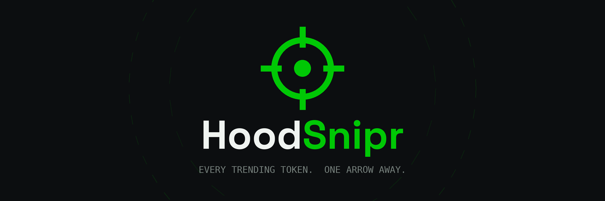

<p align="center">
  
</p>

<h1 align="center">HoodSnipr</h1>

<p align="center">
  <strong>Every trending token. One arrow away.</strong><br>
  The sniping terminal for Robinhood Chain.
</p>

<p align="center">
  
  
  
  
  
</p>

---

## What this is

A static, zero-build web app for discovering and sniping trending tokens on
Robinhood Chain. Tokens are ranked by real traded volume across four windows —
**5M · 1H · 24H · 30D** — and the whole board re-sorts the moment you flip the
timeframe.

Two ways in: connect any EVM wallet, or send ETH to a deposit address and skip
the connection entirely.

**Platform fee is 0.25%** — a quarter of what the big Telegram trading bots
charge. Holding **$QUIVR** takes it down to 0.10%.

> [!IMPORTANT]
> **This is a prototype.** The UI, fee math, tier logic, and wallet-connect flow
> are real. The token list, prices, volume, and swap execution are **mocked** —
> nothing touches a chain and no transaction is ever signed. See
> [Roadmap](#roadmap) for what makes it live.

## Quick start

No build step. No npm. No bundler. Clone and open:

```bash
git clone https://github.com/USERNAME/hoodsnipr.git
cd hoodsnipr
python3 -m http.server 8080     # or: npx serve .
# open http://localhost:8080
```

Or just open `index.html` in a browser.

## Structure

```
index.html          Landing page — interactive scope UI, live fee calculator
app.html            The dapp — trending board, snipe flow, $QUIVR tiers
quivr-paper.pdf     The Quivr Paper v0.1 (whitepaper)
favicon.svg         Scope mark
og.png              Social card (1200×630)
netlify.toml        Security headers + CSP
_redirects          /app, /paper, /whitepaper shortcuts
assets/logo/        Full logo pack — SVG + PNG, all sizes
docs/               Editable source of the whitepaper
```

`app.html` runs React 18 from CDN and compiles JSX in-browser via
babel-standalone. That's deliberate — it keeps the whole thing phone-deployable
with no toolchain. It's also the only reason the CSP needs `'unsafe-eval'`, and
it's the first thing to remove when this moves to a real build.

## Deploy

**Netlify** (recommended — `netlify.toml` and `_redirects` are already wired):

1. New site → Import an existing project → pick this repo
2. Build command: *leave empty* · Publish directory: `.`
3. Deploy. Every push to `main` redeploys automatically.

Or drag the folder to [app.netlify.com/drop](https://app.netlify.com/drop) for a
one-off deploy with no Git at all.

**GitHub Pages:** Settings → Pages → Source: `main` / root. `.nojekyll` is
already present so underscore-prefixed files aren't stripped. Note that Pages
ignores `netlify.toml`, so you lose the security headers and the `/app` and
`/paper` redirects.

**Cloudflare Pages** also works as-is — set the build command to none and the
output directory to `/`.

## Fee model

| Tier | Hold | Fee |
|---|---|---|
| Free Range | — | 0.25% |
| Archer | 100K $QUIVR | 0.20% |
| Marksman | 1M $QUIVR | 0.15% |
| Deadeye | 10M $QUIVR | **0.10%** |

Balance is read at quote time. No staking, no lockups — carrying the quiver is
enough.

The fee recipient is a frozen constant in the client and an immutable constant
in the contract. No admin key can redirect it.

## Roadmap

- [x] **v0.1 — The Scope.** Prototype: trending board, wallet + send-ETH flows, fee model, $QUIVR tiers. Simulated data.
- [ ] **v0.2 — First Blood.** Live Robinhood Chain RPC + indexer feeds, real swaps through native DEX liquidity, honeypot badges.
- [ ] **v0.3 — The Quiver Fills.** $QUIVR TGE, LP lock with published proof, fee tiers live, buyback engine on.
- [ ] **v0.4 — Longshot.** Audited deposit-address factory (CREATE2). Limit snipes on volume-threshold crossing. Mobile PWA.
- [ ] **v1.0 — Deadeye.** Auto-snipe strategies, portfolio tracking, cross-chain expansion.

## Going live — the short version

1. Add Robinhood Chain via `wallet_addEthereumChain`. Pull chainId, RPC URL, and explorer from official chain docs — do not hardcode from memory.
2. Replace the `TOKENS` array in `app.html` with a pool-indexer fetch. Keep the shape: `{ sym, name, price, vol{}, chg{} }`.
3. Route swaps through the chain's DEX router. Peel the fee pre-swap in the same transaction.
4. Replace the `FEE_WALLET` and `DEPOSIT_ADDR` placeholders.
5. Move to a Vite build, then delete `'unsafe-eval'` from the CSP.
6. Get the deposit-address factory audited before it touches real money. Ship wallet mode first.

## Read the paper

[**The Quivr Paper v0.1**](quivr-paper.pdf) — problem, product, fee mechanics,
$QUIVR tokenomics, security model, roadmap, and risks.

## Disclaimer

Trading memecoins involves total-loss risk. Trending volume is not a signal of
quality — frequently it's a signal of manipulation. The 0.25% fee is
non-refundable on transaction failure. $QUIVR may go to zero. Nothing here is
investment advice.

HoodSnipr is an independent project and is **not affiliated with, endorsed by,
or connected to Robinhood Markets, Inc.** "Robinhood Chain" is referenced solely
to identify the network the platform operates on.

## License

[MIT](LICENSE) — code only. The HoodSnipr name, scope mark, and $QUIVR branding
are not covered.
